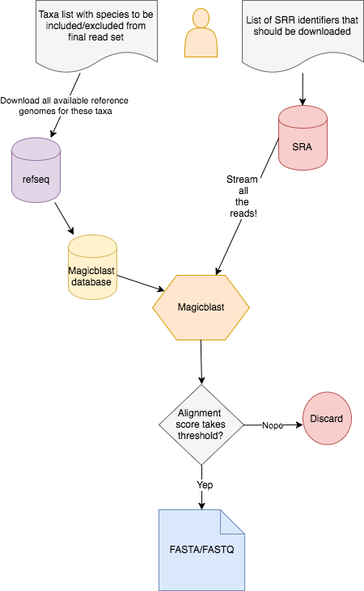

# STREAMclean - Download and filter reads from the SRA in a streaming way

## The Challenge
- The *SRA* is full of sequencing data. 🎉
- Tons of
  - sequencing platforms
  - experiment types (genomic, transcriptomic, metagenomic, younameit)
  - read qualities
- Great, lots of data to play around with, but…
    - often you don't want all the data from an experiment
        - saving 100s of read sets takes lots of space
        - files contain contaminants 😭
        - you only want individual genomes out of a metagenome
- The big question: How can we easily get only the interesting parts of *SRA* sets?

## Our solution
- Get reference genomes of interest or contaminants out of refseq to create a reference database
- Streaming the data right out of the *SRA* and use `magicblast` to compare to our reference database
- only save those reads you actually want!

## How to install it:
- clone this repository `git clone `https://github.com/NCBI-Hackathons/NanoporeMapper`
- install the required python libraries `pip install -r requirements.txt`
- [download `magicblast` from NCBI](https://ncbi.github.io/magicblast/doc/download.html)

## How to use it: Bash wrapper script  
`./mapper_wrapper.sh -d test1 -i bacteria -s SRR4420340`

or more specifically

`./mapper_wrapper.sh -d test1 -i "-t 199310 bacteria" -s SRR4420340`

This will:
1. Download specified reference genomes using the [ncbi-genome-download package](https://github.com/kblin/ncbi-genome-download).
2. Create a [magic-blast](https://ncbi.github.io/magicblast/) database of the collected reference genomes.
3. Map the SRA accessions against the whitelist/blacklist reference database.
